# 医疗报告系统 v2.0 (OncoPath)

> 基于 FastAPI + Vue 3 的智能健康信息整理与医疗报告管理工具：检验指标 OCR 自动识别匹配、治疗时间线聚合、AI 检验解读，并通过 AgentTeams 集成承接虚拟会诊入口。

[](./LICENSE)
[](#状态说明)
[](#技术栈)
[](#技术栈)
[](https://nickzhang1102.github.io/oncopath/)

🌐 **项目网站**：[nickzhang1102.github.io/oncopath](https://nickzhang1102.github.io/oncopath/)

> **状态说明**：本项目已公开，当前处于早期版本阶段。欢迎试用与反馈；生产环境部署前必须完成本文档【安全说明】中的全部必改项，并自行评估当地医疗数据合规要求。

---

## 项目愿景

OncoPath 面向懂技术的患者家属和家庭自部署场景，提供医疗报告整理、OCR 指标提取、治疗时间线聚合与 AI 辅助解读能力。系统将散落在各处的检验、检查、病理、用药、随访数据汇聚成一条可追溯的治疗时间线，并通过 AgentTeams 集成入口承接虚拟会诊分析，帮助用户更好地整理资料、理解信息并与医生沟通。

---

## 界面预览

> 以下截图均由当前前端以固定的虚构演示数据自动生成。姓名、联系方式、证件号等身份字段已掩码，并带有“演示数据 · 已脱敏”标记；不含真实患者资料。生成与审查规则见 [截图维护说明](docs/screenshots/README.md)。

### 首页与重要指标

**首页重要指标列表** — 在一个工作台查看报告数量、异常项、待办和分组指标。

<p align="center">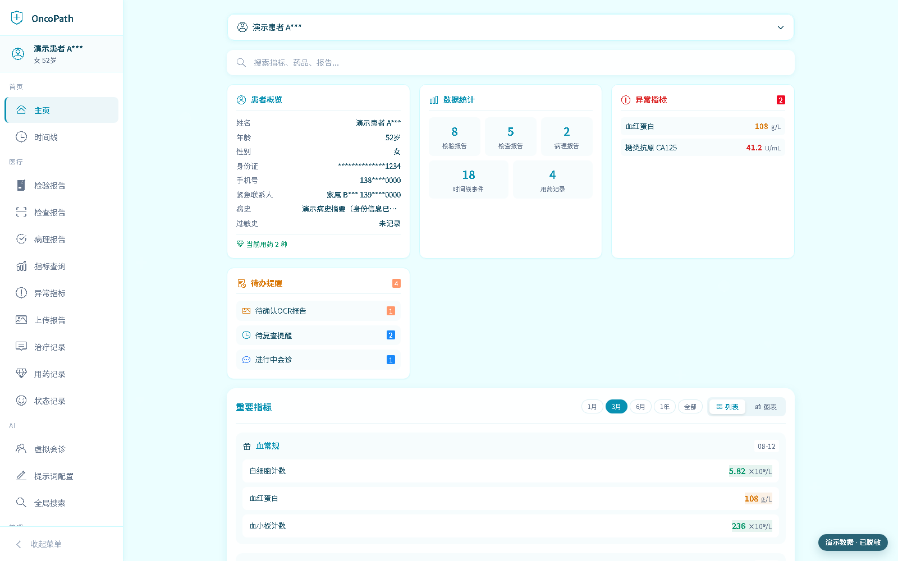</p>

**首页重要指标图表** — 结合参考范围与连续时间点查看关键指标的变化。

<p align="center">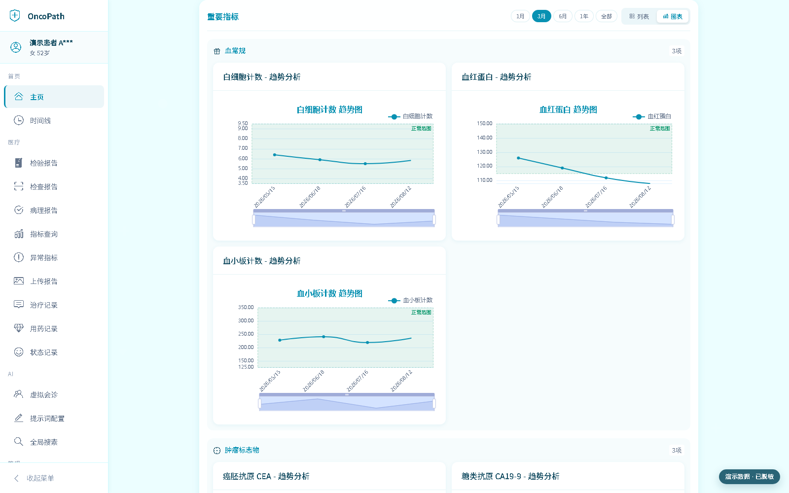</p>

### 报告归集

**检验报告** — 原始指标、异常状态、参考范围与 AI 辅助解读在同一详情页呈现。

<p align="center">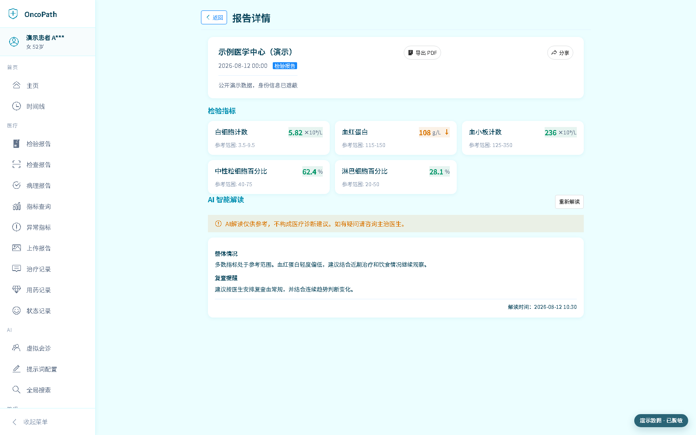</p>

**检查报告** — 统一呈现检查所见、诊断意见和随访提示。

<p align="center">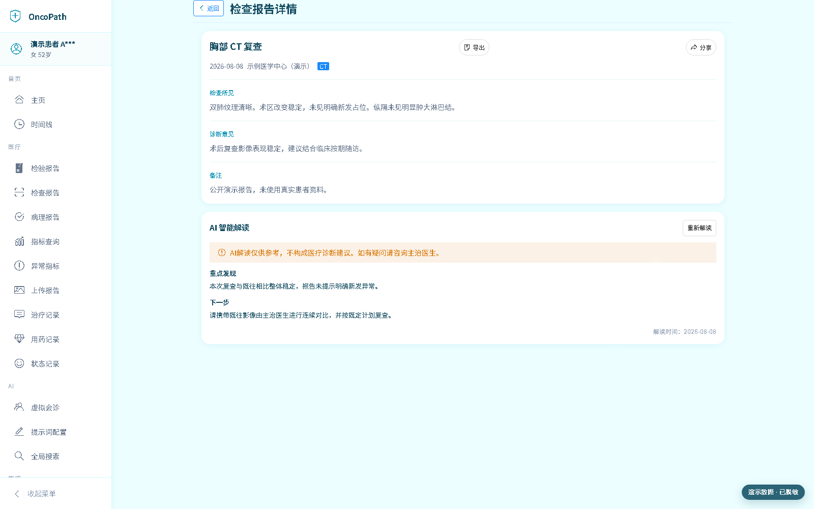</p>

**病理报告** — 按报告结构归集病理诊断、组织学、免疫组化与基因检测信息。

<p align="center">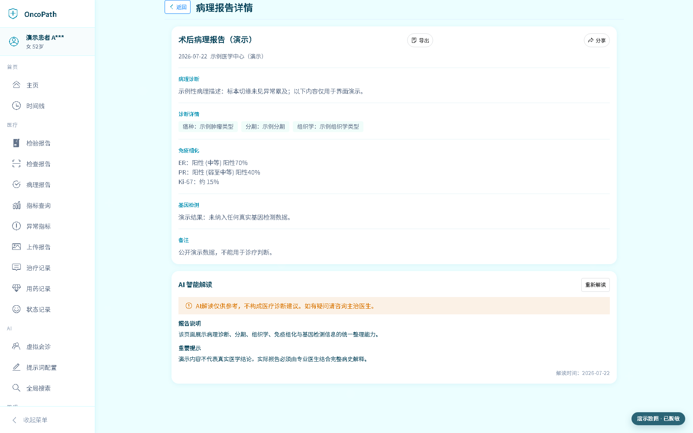</p>

### 组合指标查询

**组合指标表格** — 将多项相关指标按日期对齐，便于横向比较。

<p align="center">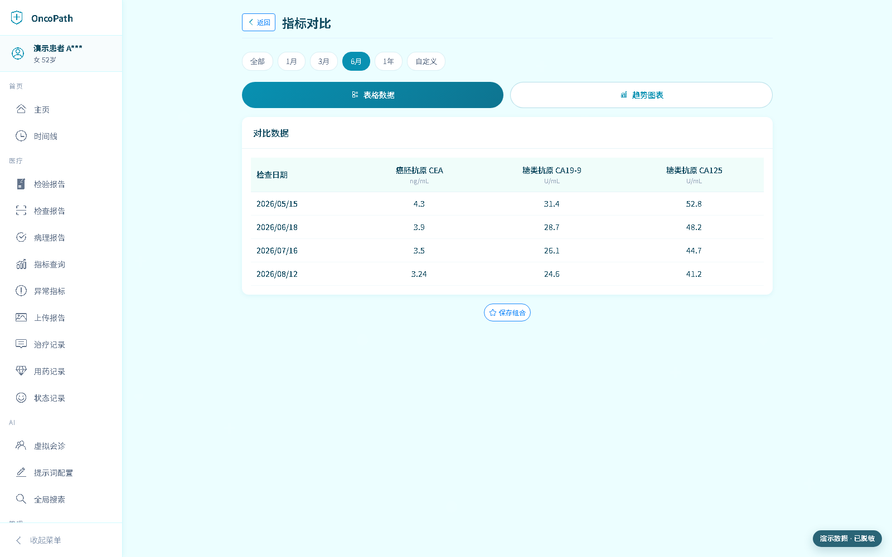</p>

**组合指标趋势** — 选择一到两项指标进入趋势图，减少跨页面切换。

<p align="center">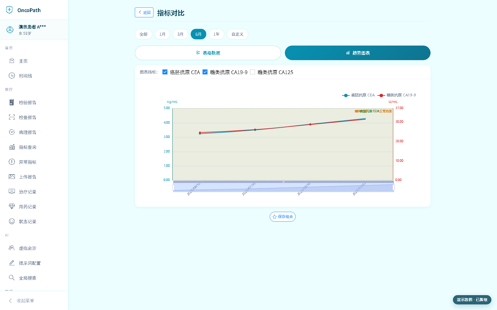</p>

### 虚拟会诊与知识库

**虚拟会诊历史** — 查看会诊状态、摘要与继续跟进入口。

<p align="center">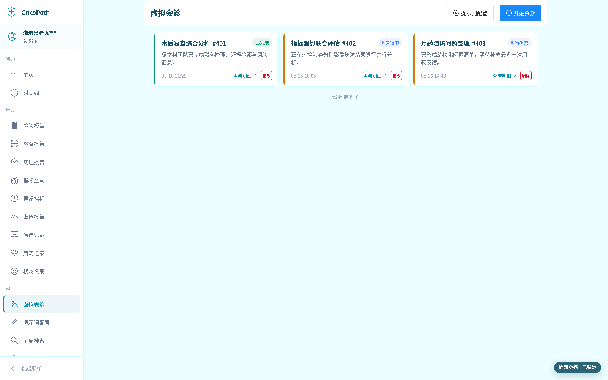</p>

**虚拟会诊工作台** — OncoPath 聚合资料并承接 AgentTeams 的多智能体会诊过程。

<p align="center">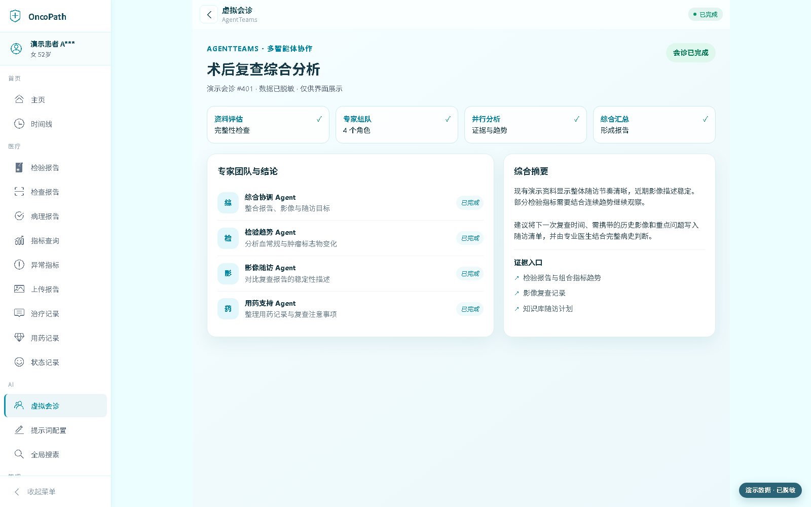</p>

**知识库** — 用分类、搜索、摘要与预览沉淀随访和护理资料。

<p align="center">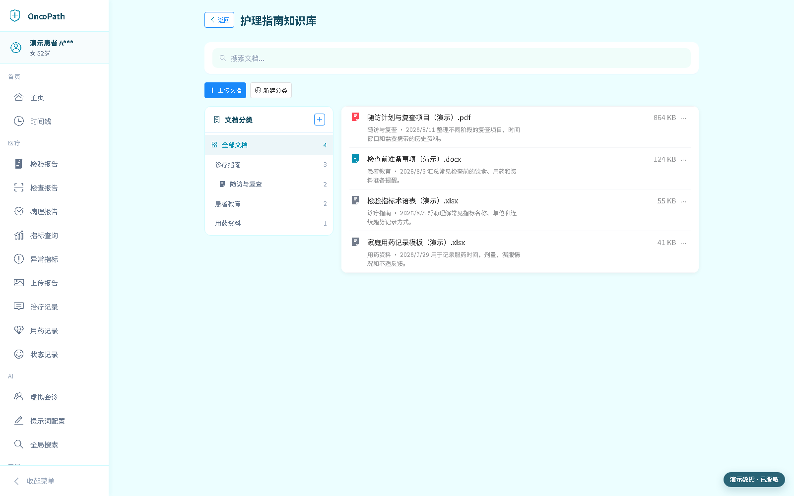</p>

### 移动端

移动端继续使用相同的脱敏演示数据，重点覆盖首页、报告、组合指标、虚拟会诊与知识库的窄屏操作路径。

<p align="center">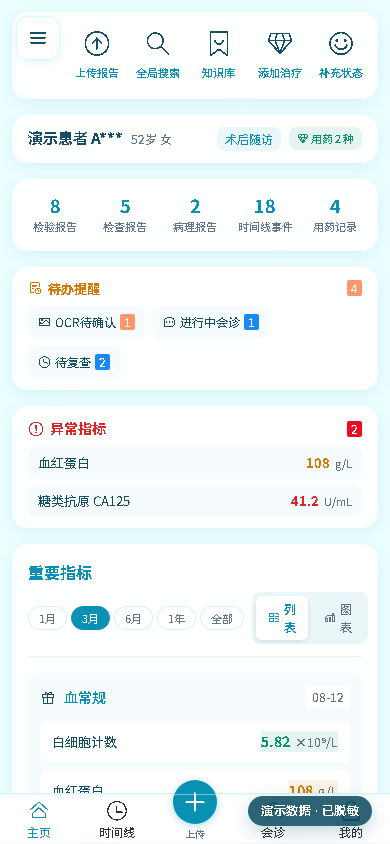</p>

<p align="center">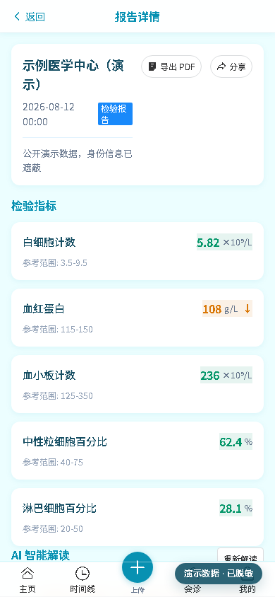</p>

<p align="center">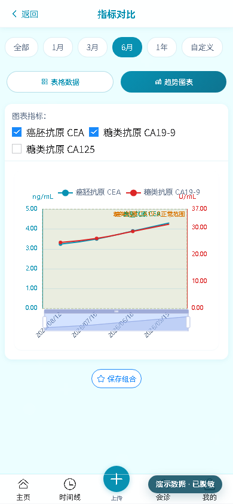</p>

<p align="center">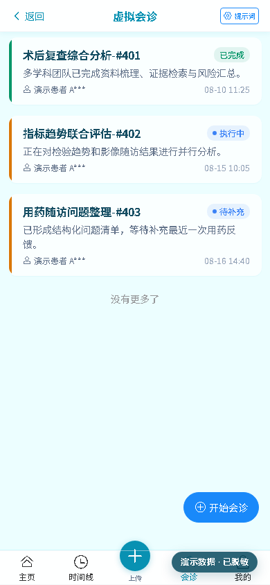</p>

<p align="center">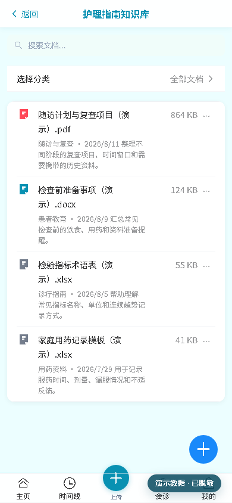</p>

---

## 核心功能

### 患者与医疗数据
- **患者管理**：多患者账号支持；患者敏感字段（姓名/电话/身份证）Fernet 静态加密存储；身份证号单向哈希索引用于查重；主患者标识与切换；患者编辑 PHI 审计日志。
- **医疗数据管理**：检验报告（MedicalCheck）、检查报告（MedicalExam）、病理报告（PathologyReport）、病情记录（MedicalRecord）的完整 CRUD；指标标准库与用户收藏；异常指标追踪。

### OCR 与 AI 能力
- **OCR 指标提取系统**：PaddleOCR 图片文本识别 → LLM 智能解析表格结构（OpenAI 兼容接口）→ LLM 直接匹配标准库 → 结果落库；按报告分类自动分流为检验类/检查类/病理类三种处理流程；OCR 结果人工审查与修正。
- **AI 检验解读**：LLM 将专业指标翻译成通俗语言，输出整体评估、异常指标解读、趋势变化、建议与提醒；自动从解读结果中提取复查建议并创建随访提醒。
- **虚拟会诊（AgentTeams 集成）**：OncoPath 负责患者资料聚合、会诊 prompt 生成、启动入口、历史壳和 iframe 展示；会诊执行、Agent 团队编排、额度与使用记录由外部 AgentTeams 项目承担。

### 治疗全景
- **治疗时间线**：统一聚合服务从 5 张表（timeline_events / medical_check / medical_exam / pathology_report / medication）聚合时间线，支持里程碑标记、多维度筛选与日期范围统计。
- **用药管理与服药打卡**：用药记录 CRUD（含停药操作）、服药打卡（taken/skipped/missed）、今日服药任务列表、依从性统计（7–365 天范围）。
- **随访提醒**：手动 / AI 解读 / 会诊三种来源；状态流转 pending → sent → confirmed/expired；确认复查闭环。

### 平台支撑
- **仪表盘**：聚合首页数据（当前用药、异常指标、各类报告计数、待审 OCR、进行中会诊、待处理随访、近期事件），并行查询 + 超时保护。
- **知识库**：分类树管理、文档上传/下载/预览/搜索、访问日志记录；支持 txt/pdf/office/图片等多种文件类型。
- **数据导出**：基于 Jinja2 模板和 Playwright/Chromium 导出检验报告 PDF、时间线 PDF、完整病历 PDF，内置中文字体支持。
- **文件存储服务**：StorageService 抽象层，支持本地文件系统（含路径遍历防护）并预留 MinIO 扩展。
- **报告分享**：ShareToken 限时限次访问，支持会诊对话分享与检验/检查/病理报告分享。
- **全局搜索**：跨模块搜索（检验指标/检查报告/病理/用药/时间线），ILIKE 模糊匹配 + 按日期排序。
- **管理后台**：用户管理、指标库 CRUD / 拖拽排序 / 批量导入、指标分类管理。

### 安全增强
- SECRET_KEY 启动校验（拒绝默认值）、PHI 字段 Fernet 对称加密、SSO 单点登录（会话管理 + Token 黑名单）、登录失败锁定（Redis Lua 原子操作）、SlowAPI 限流、DOMPurify XSS 防护、路径遍历防护、患者编辑 PHI 审计日志。

---

## 技术栈

### 后端
| 类别 | 选型 |
|------|------|
| 框架 | FastAPI 0.109+ |
| ORM | SQLAlchemy 2.0（Async） |
| 数据库 | PostgreSQL 17 + pgvector 扩展 |
| 缓存 / 锁 / 会话 | Redis 7 |
| AI | OpenAI 兼容 LLM API（解读 / OCR 解析）；虚拟会诊执行由 AgentTeams 集成承接 |
| OCR | PaddleOCR 3.x（默认 CPU，可选 NVIDIA GPU）+ LLM（OpenAI 兼容接口） |
| 异步任务 | Celery + Redis（随访提醒定时任务） |
| 安全 | Fernet 对称加密（PHI 字段静态加密）、bcrypt、JWT |
| 限流 | SlowAPI |
| PDF 导出 | Playwright/Chromium + Jinja2 模板 |
| LLM JSON 解析 | 自研 `utils/llm_parser.py`（3 策略 + 中文标点归一化） |

### 前端
| 类别 | 选型 |
|------|------|
| 框架 | Vue 3.4（Composition API） |
| UI 库 | Vant 4.9 |
| 状态管理 | Pinia |
| 路由 | Vue Router 4 |
| 构建工具 | Vite 8 |
| 图表 | ECharts 6（按需导入） |
| 安全 | DOMPurify（v-html 渲染前 XSS 防护） |
| 导出 | html2canvas + jsPDF + html2pdf.js |
| Markdown | marked + highlight.js |
| HTTP | axios |

### 部署
| 类别 | 选型 |
|------|------|
| 容器化 | Docker + Docker Compose |
| 反向代理 | Nginx |
| 存储 | 本地文件系统（抽象层支持 MinIO 扩展） |

---

## 系统架构

```
+-----------------------------------------------------------------+
|                        前端层 (Vue 3 + Vant)                     |
|  登录 / 主页(仪表盘) / 时间线 / 会诊(AgentTeams) / AI解读 / 知识库 |
|  图片报告(OCR) / 指标查询 / 用药打卡 / 随访 / 全局搜索 ...        |
+-----------------------------------------------------------------+
                              | HTTP/REST + 通知/上传 SSE
+-----------------------------------------------------------------+
|                  API 网关层 (FastAPI, 30 路由模块)               |
|  认证 / 用户 / 患者 / 医疗 / 会诊 / 时间线 / 用药 / 服药记录     |
|  随访 / 仪表盘 / 导出 / 分享 / 搜索 / 文件                       |
|  图片报告 / 知识库 / 提示词 / 上传 / 指标历史 / 管理后台         |
+-----------------------------------------------------------------+
                              |
+-----------------------------------------------------------------+
|                服务层 (Business Logic)                           |
|  AgentTeamsStartService / AgentTeamsConfigService                |
|  MedicalPromptBuilder / LLMService / InterpretationService       |
|  OCR 集成服务(7子服务) / TimelineAggregator / ExportService      |
|  StorageService / EncryptionService / SessionService            |
|  Desensitization / LockService                                   |
+-----------------------------------------------------------------+
                              |
+-----------------------------------------------------------------+
|                        数据层                                    |
|  PostgreSQL 17 (主存储) | Redis 7 (缓存/锁/会话)                |
|  OpenAI 兼容 LLM API (解读+OCR) | AgentTeams (外部会诊执行)   |
|  本地文件存储 | Playwright/Chromium (PDF 渲染)                  |
+-----------------------------------------------------------------+
```

---

## 快速开始（Docker）

最快的方式是用 Docker Compose 一键拉起完整环境。

### 1. 克隆与配置

```bash
git clone https://github.com/nickzhang1102/oncopath.git
cd oncopath
cp .env.example .env
```

编辑 `.env`，**必须填写**以下 5 项（其余按需调整）：

| 变量 | 说明 | 生成方式 |
|------|------|----------|
| `SECRET_KEY` | JWT 签名密钥，至少 32 字符，启动时校验拒绝默认值 | `openssl rand -hex 32` |
| `DB_PASSWORD` | PostgreSQL 密码 | 自定义强密码 |
| `REDIS_PASSWORD` | Redis 密码 | 自定义强密码 |
| `ENCRYPTION_KEY` | PHI 字段 Fernet 加密密钥（生产必填） | `python -c "from cryptography.fernet import Fernet; print(Fernet.generate_key().decode())"` |
| `LLM_API_KEY` | 本地 AI 解读与知识库摘要使用的 OpenAI 兼容 LLM API Key | 你的 LLM 服务商后台 |

> 其余 LLM 配置（`LLM_API_BASE` / `LLM_MODEL_NAME` / `OCR_LLM_API_KEY` / `OCR_LLM_API_BASE` / `OCR_LLM_MODEL_NAME`）按你使用的 OpenAI 兼容服务填写。AgentTeams 使用独立的后台集成配置，详见 [`docs/deployment/agentteams-integration.md`](./docs/deployment/agentteams-integration.md)。

### 2. 启动服务

```bash
docker compose up -d
docker compose ps
```

容器端口映射（与 `docker-compose.yml` 一致）：
- **前端**：默认仅绑定宿主机 `127.0.0.1:3000` → 容器 `80`（Nginx）
- **后端 API / PostgreSQL / Redis**：仅通过 Docker 内部网络访问，不发布宿主端口

如需局域网直接访问前端，可显式设置 `FRONTEND_BIND_ADDRESS=0.0.0.0`；生产环境建议保持 loopback，由宿主机反向代理提供 HTTPS。

### 3. 初始化数据库

backend 容器启动时会自动执行 `alembic upgrade head` 建立/升级表结构，再运行幂等种子脚本创建默认管理员、指标分类和标准指标。默认管理员账号为 `admin`，密码取自 `ADMIN_INITIAL_PASSWORD` 环境变量，未设置则使用默认密码 `admin123`（**生产环境务必设置 `ADMIN_INITIAL_PASSWORD` 并登录后立即修改**）。

### 4. 访问

- 前端：http://localhost:3000
- API 健康检查：http://localhost:3000/api/v1/health

---

## 本地开发

### 前置依赖

- Python 3.11（与后端镜像一致，推荐使用独立虚拟环境）
- Node.js 20.19+ 或 22.12+
- PostgreSQL 17（需安装 pgvector 扩展）
- Redis 7+
- Docker & Docker Compose（可选，用于拉起 PG / Redis）

### 数据库准备

1. 创建空数据库 `medical_report`：
   ```sql
   CREATE DATABASE medical_report;
   ```
2. 运行 Alembic public baseline 建表并记录 schema 版本。
3. 运行 `init_fresh_db.py` 写入幂等种子数据（见下文后端启动步骤）。

### 后端

```bash
cd back

# 1. 准备环境变量（从根目录复制模板到 back/ 下，因为 config.py 的 env_file=".env" 相对工作目录）
cp ../.env.example .env
#   编辑 back/.env，填入本地 PostgreSQL / Redis / LLM 配置：
#   - DB_HOST=localhost / DB_PORT=5432（本地开发直连）
#   - REDIS_HOST=localhost / REDIS_PORT=6379
#   - SECRET_KEY / ENCRYPTION_KEY / LLM_API_KEY 等按上文生成

# 2. 激活 conda 环境
conda activate oncopath

# 3. 建立/升级 schema，再初始化幂等种子数据
alembic upgrade head
python scripts/init_fresh_db.py

# 4. 启动开发服务器
uvicorn app.main:app --reload --port 8000
```

> 如需随访提醒定时任务，另起终端运行 Celery worker 和 beat：
> ```bash
> cd back
> conda activate oncopath
> celery -A app.core.celery_app worker --loglevel=info
> celery -A app.core.celery_app beat --loglevel=info
> ```

### 前端

```bash
cd front
npm install
npm run dev
# 访问 http://localhost:3000
```

> 前端开发服务器默认监听 3000 端口，需在 `.env` 的 `CORS_ORIGINS` 中包含 `http://localhost:3000`（模板已默认包含）。

---

## 项目结构

```
oncopath/
├── back/                          # 后端（FastAPI）
│   ├── app/
│   │   ├── api/                   # 30 个路由模块（auth/patient/medical/consultation/...）
│   │   ├── core/                  # config / database / security / redis / rate_limit / celery_app
│   │   ├── models/                # SQLAlchemy 数据模型（patient/medical/conversation/...）
│   │   ├── schemas/               # Pydantic v2 响应/请求模型
│   │   ├── services/              # 业务逻辑（AgentTeams 集成/OCR/LLM/...）
│   │   │   ├── consultation/      # AgentTeams 启动所需的患者上下文与摘要服务
│   │   │   └── ocr/               # 7 个 OCR 子服务
│   │   ├── utils/                 # llm_parser / time_utils / thumbnail
│   │   └── tasks/                 # 知识库摘要与 Celery 随访提醒任务模块
│   ├── scripts/                   # init_fresh_db.py 等运维脚本
│   ├── alembic.ini                # Alembic 配置（公开基线及后续迁移位于 migrations/versions/）
│   ├── tests/                     # pytest 单元与集成测试
│   ├── requirements.txt
│   └── Dockerfile
├── front/                         # 前端（Vue 3 + Vant）
│   ├── src/
│   │   ├── views/                 # 页面（30+ 视图组件）
│   │   ├── components/            # 组件（consultation/knowledge/image-report/timeline/...）
│   │   ├── stores/                # Pinia 状态（user/patient/conversations/...）
│   │   ├── api/                   # axios 封装的 API 模块（20 个）
│   │   ├── composables/           # useSSEStream / useResponsive / useTheme / useOCRReview
│   │   ├── utils/                 # sanitize / echarts / export / errorHandler / ...
│   │   └── styles/                # theme-colors / constants / vant-theme / index.css
│   ├── vite.config.js
│   ├── package.json
│   └── Dockerfile
├── docker-compose.yml             # 容器编排（数据库/API 内网，前端默认 loopback:3000）
├── .env.example                   # 环境变量模板
├── LICENSE
├── CONTRIBUTING.md
├── DISCLAIMER.md
└── README.md
```

---

## API 概览

后端共 30 个路由模块，统一注册于 `app/routers.py`。本地直接启动后端时，可访问 [Swagger UI](http://localhost:8000/docs) 查看完整端点定义；Docker 生产部署不向宿主机发布 backend 端口。

| 路由模块 | 路径前缀 | 说明 |
|----------|----------|------|
| 认证 | `/api/v1/auth` | 注册、登录（单会话管理）、刷新令牌、登出 |
| 用户 | `/api/v1/accounts` | 个人信息、修改密码、隐私设置、通知 CRUD |
| 患者 | `/api/v1/patients` | 患者 CRUD、加密+哈希查重、脱敏详情、PHI 编辑审计、主患者切换、患者时间线/统计/会诊 |
| 会诊 | `/api/v1/consultation` | AgentTeams 可用性查询、外部会诊启动、外部会话映射、历史详情；旧本地会诊运行时入口已下线 |
| 医疗 | `/api/v1/medical` | 检验/检查/病理/病情记录 CRUD、指标标准库查询、收藏、异常指标 |
| 时间线 | `/api/v1/timeline` | 时间线事件 CRUD、统计 |
| 用药 | `/api/v1/medications` | 用药记录 CRUD、停药 |
| 服药打卡 | `/api/v1/medication-logs` | 打卡记录、今日任务、依从性统计 |
| 随访 | `/reminders` | 随访提醒 CRUD、确认复查 |
| 仪表盘 | `/api/v1/dashboard` | 首页聚合数据 |
| 导出 | `/export` | 检验报告 / 时间线 / 完整病历 PDF |
| 分享 | `/share` | 报告分享令牌生成与访问 |
| 搜索 | `/search` | 跨模块全局搜索 |
| 文件 | `/files` | 本地文件服务（需认证） |
| 图片报告 | `/api/v1/image_reports` | 图片报告 CRUD、上传（后台 OCR / SSE 进度）、去重校验 |
| 知识库 | `/api/v1/knowledge` | 分类树、文档 CRUD、搜索 |
| 提示词 | `/api/v1/prompt` | 按患者保存的 AI 提示词配置 |
| 上传 | `/api/v1/upload` | 报告图片上传与状态查询 |
| 指标历史 | `/api/v1/indicator-history` | 指标历史趋势（含 up/down/stable 计算） |
| 管理后台 | `/api/v1/admin` | 用户管理、指标库 CRUD/排序/批量导入、指标分类管理（需 admin 鉴权） |

> 所有接口默认需要认证（除登录/注册/分享链接等显式标注的端点）。会诊接口限流 5/min，登录 5/min，上传 10/min，默认 100/min。

---

## 测试

后端使用 pytest + pytest-asyncio，测试覆盖单元、接口、数据库 baseline 和集成场景。

```bash
cd back
conda activate oncopath

# 运行全部测试
pytest tests/ -v

# 带覆盖率报告
pytest tests/ -v --cov=app --cov-report=html

# 仅单元测试
pytest tests/ -v -k "not integration"

# 仅集成测试
pytest tests/integration/ -v
```

> 测试需要可用的测试数据库（PostgreSQL）与 Redis。AgentTeams 会诊集成测试可按 `docs/testing/agentteams-consultation.md` 中的命令运行。

---

## 部署

生产部署以 `docker-compose.yml` 为准。部署前请逐项确认【安全说明】中的必改项：

PaddleOCR 默认使用 CPU。NVIDIA GPU 环境需要同时叠加 `docker-compose.gpu.yml`，并预先安装 NVIDIA Container Toolkit；两套环境的硬件要求、完整命令、验证、切换和排障见 [PaddleOCR CPU / NVIDIA GPU 部署指南](./docs/deployment/ocr-cpu-gpu.md)。

- 修改 `.env` 中的 `SECRET_KEY`、`DB_PASSWORD`、`REDIS_PASSWORD`、`ENCRYPTION_KEY`、`LLM_API_KEY`
- 设置 `ADMIN_INITIAL_PASSWORD` 为强密码，并登录后立即修改 admin 密码
- `CORS_ORIGINS` 限制为实际前端域名
- `ALLOW_UNENCRYPTED_PHI` 保持 `false`（生产环境必须配置 `ENCRYPTION_KEY`）
- 配置 HTTPS（在 `docker-compose.yml` 的 frontend 段取消 443 端口注释并提供 SSL 证书，或由外部反向代理终结 TLS）
- 设置防火墙规则，仅开放 80/443
- 保持 `FRONTEND_BIND_ADDRESS=127.0.0.1`，由宿主机反向代理公开 80/443
- 配置 PostgreSQL 定时备份

```bash
# 生产启动
docker compose --env-file .env up -d

# backend entrypoint 会自动迁移 schema 并初始化幂等种子数据
```

## 安全说明

### 数据安全
- **PHI 字段加密**：患者姓名、电话、身份证等敏感字段使用 Fernet 对称加密静态存储；身份证号单向 SHA-256 哈希索引用于查重。
- **密码存储**：bcrypt 哈希。
- **PHI 访问审计**：患者编辑接口访问明文 PHI 时记录审计日志；列表/详情接口返回脱敏数据。

### 认证与授权
- **JWT + SSO 单点登录**：SessionService 基于 Redis 实现会话管理，新登录踢下线旧会话，旧 Token 进入黑名单。
- **登录失败锁定**：5 次 / 15 分钟，基于 Redis Lua 原子操作。
- **管理后台**：所有 `/api/v1/admin` 端点需 admin 角色鉴权。

### 接口与运行时安全
- **默认认证**：所有接口默认需要认证（除登录/注册/分享链接等）。
- **限流**：SlowAPI，登录 5/min、会诊 5/min、上传 10/min、默认 100/min。
- **SQL 注入防护**：SQLAlchemy ORM 参数化查询。
- **XSS 防护**：前端 v-html 渲染前使用 DOMPurify 消毒。
- **路径遍历防护**：StorageService 解析路径时校验，禁止越界访问。

### 生产环境必改项
| 项 | 说明 |
|----|------|
| `SECRET_KEY` | 使用 `openssl rand -hex 32` 生成强随机值，启动时校验拒绝默认值 |
| `DB_PASSWORD` / `REDIS_PASSWORD` | 使用强密码 |
| `ENCRYPTION_KEY` | 使用 `Fernet.generate_key()` 生成；**若库中已有用旧 key 加密的 PHI 数据，轮换时必须先用旧 key 解密再用新 key 重新加密** |
| `ADMIN_INITIAL_PASSWORD` | 设置强密码，登录后立即修改 |
| `CORS_ORIGINS` | 限制为实际前端域名，不要使用通配 |
| `ALLOW_UNENCRYPTED_PHI` | 保持 `false` |

---

## ⚠️ 医疗免责声明

**本系统的 AgentTeams 虚拟会诊入口、检验指标解读、OCR 识别等功能仅作健康信息整理、辅助理解和辅助分析，不构成医疗诊断或治疗建议，也不属于医疗器械用途，不能替代执业医师的专业判断。** 本系统不适用于紧急医疗情况；使用者应自行核实系统输出并咨询合格执业医师。使用本系统造成的任何后果由使用者自行承担。详见 [DISCLAIMER.md](./DISCLAIMER.md)。

---

## License

本项目基于 [Apache License 2.0](./LICENSE) 开源。第三方依赖和镜像资产保留各自许可证，详见 [THIRD_PARTY_NOTICES.md](./THIRD_PARTY_NOTICES.md)。

版权所有 © 2026 nickzhang1102

---

## 贡献指南

欢迎参与贡献！请阅读 [CONTRIBUTING.md](./CONTRIBUTING.md) 了解 Fork → 分支 → 提交 → PR 的完整流程与代码规范。
